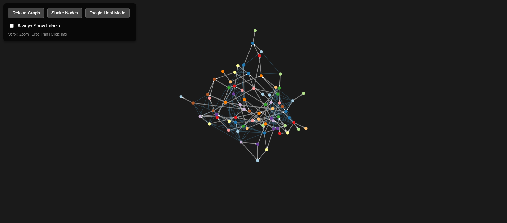
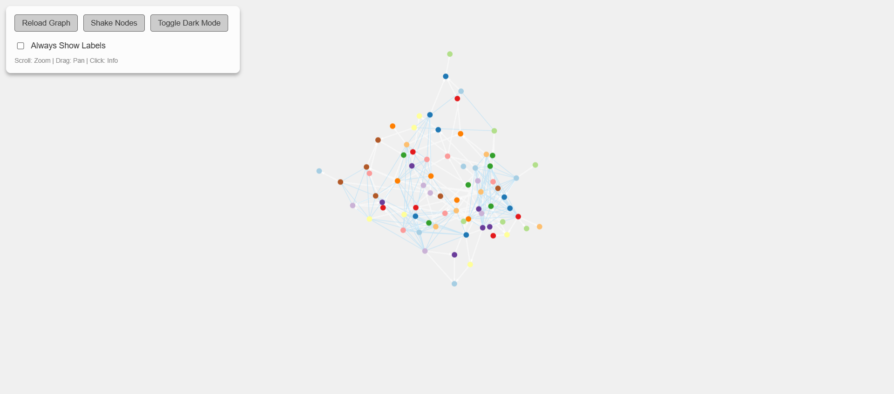
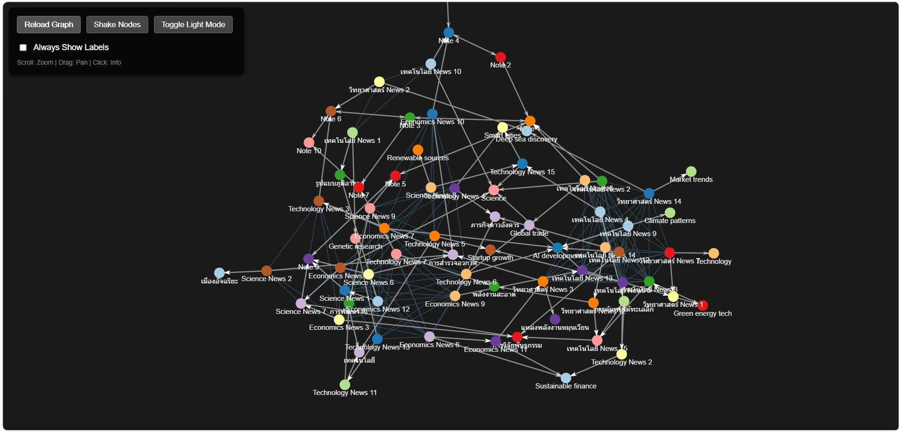

# Wiki Graph Explorer (Project: My MD Wiki)

## Project Overview & Team Dynamics

This project is a collaborative engineering effort between a **Human Supervisor** and **Gemini (AI Coder)**. 

### Supervisor Opinion & Role
The supervisor provided the vision: a high-performance, standalone wiki visualization tool that mirrors the "Graph View" of professional tools like Obsidian, but with expanded semantic intelligence. The supervisor managed the architectural direction, specifically pushing for:
- Multilingual support (Thai/English).
- Hybrid linking (Manual Wiki-links + Semantic Vector Similarity).
- Integrated management via a CLI menu.
- AI-accessible knowledge via a custom Gemini CLI Skill.

### Developer Opinion (Gemini)
As the coder, I found this project to be an excellent exercise in **hybrid data topology**. The most interesting challenge was integrating the **ChromaDB Vector Store** with a frontend **Force-Directed Graph**. 
- **Topology:** The graph isn't just a static map; it's a living representation of "meaning." By using `Intl.Segmenter` for Thai/English, we've enabled the graph to "discover" connections that the user might have missed.
- **Robustness:** Using a Node.js/ESM backend with a Python-based Vector tool creates a polyglot system that is fast, modular, and easy to extend.

---

## 📸 Application Screenshots

### Dark Mode (Default)


### Light Mode


### Node Information & Clusters


### Custom Note Clusters (a01, a02, a03)


---

## 🚀 Quickstart

### 1. Prerequisites
- **Node.js** (v20+)
- **Python 3.10+**
- **Pip dependencies:** `pip install chromadb`

### 2. Installation
```bash
git clone <this-repo>
cd my_md_wiki
npm install
```

### 3. Usage
Run the management CLI:
```bash
npm start
```
From the menu:
1. Select `1` to **Start Server**.
2. Select `4` to **Generate News Data** (optional).
3. Select `5` to **Index Vector DB**.
4. Select `7` to **Open Browser**.

---

## 🛠 Features
- **Obsidian-like Graph:** Real-time force-directed simulation.
- **Multilingual Segmentation:** Proper word breaking for Thai and English content.
- **Semantic Clustering:** Dashed blue lines show "Conceptual Vectors" between nodes sharing similar keywords.
- **Vector Search:** Semantic query capability powered by ChromaDB.
- **AI Skill:** A registered `.skill` file allows Gemini CLI agents to query your knowledge base autonomously.

---

## ⚠️ Known Bugs & Issues
While the core visualization and data layers are robust, the following frontend issues are currently being tracked:
- **Refresh/Reload Button:** In some browser environments, the `Reload Graph` button triggers a data fetch but may not correctly re-render the canvas until a manual browser refresh (F5).
- **Shake Nodes Simulation:** The `Shake Nodes` function (Simulation Reheat) can sometimes be ignored by the D3-force engine if the simulation alpha has already dropped to zero. We are investigating a more aggressive alpha-decay reset.
- **Theme Transition:** While the colors update, the initial render color of the Canvas particles might lag by one frame during theme switching.

---

## 📜 License
Distributed under the **MIT License**. See `LICENSE` for more information.

---
*Created with ❤️ by Gemini and Human Supervisor.*
